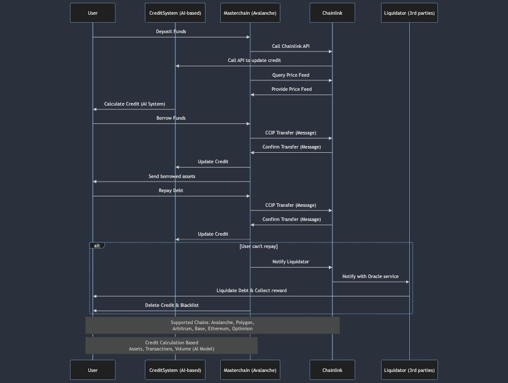
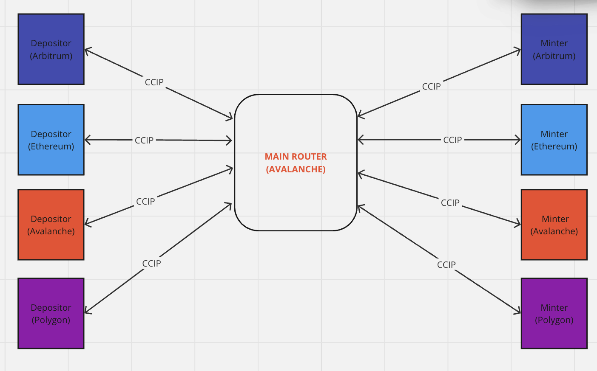

# Inspiration
The challenges in lending and borrowing tokens across different blockchain networks are significant. To address these challenges, BuckyFinance envisions creating an ecosystem that can harness liquidity across the entire blockchain space. Utilizing Chainlink's advanced technologies such as Cross-Chain Interoperability Protocol (CCIP), Functions APIs, and Data Feeds, we aim to realize this vision effectively.

# High-Level Architecture
BuckyFinance facilitates the depositing of tokens on one blockchain and borrowing from another. This is achieved through a robust architecture that leverages Chainlink infrastructure for a secure and efficient process. The collateral rate and credit system are determined based on a comprehensive evaluation of various factors, including:

- Total wallet balance

- Number of transactions made

- Volume of transactions participated in on-chain

These data points are continuously monitored by many off-chain services and updated via Chainlink Functions.

# How It Is Built
We implemented the following Chainlink technologies to build the protocol:

- CCIP (Cross-Chain Interoperability Protocol): Used for transferring tokens across different blockchains seamlessly.

- Chainlink Data Feed: Utilized to obtain real-time price data from decentralized oracles, ensuring accurate and up-to-date information for collateral valuation.

- Chainlink Functions: Employed to query and calculate credit scores based on a robust AI-powered infrastructure, which takes into account various on-chain activities and balances.

# In-depth Architecture

## Borrowing and Lending in Depth

- In our protocol's architecture, there is a `Main Router` deployed on Avalanche for storing all protocol information and logic. It is the center of our protocol; every transaction must be confirmed by the `Main Router` to go through.

### Deposit Collateral and Borrow DSC
- Suppose users have some ETH on Arbitrum and they want to have some funds on Polygon without selling the `ETH` or bridging it. They can leverage `BuckyFinance` by depositing ETH into the protocol and then borrowing our `DSC` token on Polygon, all in one transaction.
- **How it works:** Users can deposit their collateral into our `Depositor` contract on `Arbitrum`. The `Depositor` then sends a CCIP message to the `Main Router` on `Avalanche` to notify the protocol that the user has deposited funds. After that, the `Main Router` sends a CCIP message to the `Minter` contract on Polygon, which will mint `DSC` tokens for the user.

### Borrow DSC
- If users have collateral gathered on various chains, such as Arbitrum and Ethereum, and they want to borrow funds on Optimism, they can approach the `Main Router` on `Avalanche` to borrow. The `Main Router` will send a CCIP message to the `Minter` contract on Optimism to mint `DSC` tokens for the user.
- The amount of `DSC` tokens a user can borrow is determined by the collateral they have deposited on all supported chains and their `credit`, calculated by:

$$ \text{Amount can be borrowed} = \text{Total Deposited Collateral on All Chains} \times (\text{Loan to Value Ratio} + \text{Credit Score}) $$

### Redeem Collateral
- If the user wants to withdraw their collateral on a chain, such as Arbitrum, they must go to the `Main Router` on Avalanche. It will confirm if the user can withdraw the collateral. If confirmed, the `Main Router` will send a CCIP message to the `Depositor` on Arbitrum to notify it to send tokens back to the user.
- Users can withdraw their collateral if they don't breach their `health factor`, which is determined by:

$$ \text{Health Factor} = \frac{\text{Total Deposited Collateral on All Chains} \times \text{Liquidation Threshold}}{\text{Total Borrowed DSC on All Chains}} $$

### Swap DSC Token Multichain
- If users want to swap `DSC` tokens from chain `A` to chain `B`, they can do so in one transaction by using the `burnAndMint` function on chain `A`'s `Minter` contract. The `Minter` will burn `DSC` on chain `A`, then send a CCIP message to the `Main Router`. The `Main Router` will then send a CCIP message to the `Minter` contract on chain `B` to mint `DSC` tokens for the user.

## Credit System
We leverage Chainlink Functions to call our Credit API in a decentralized manner. The API aggregates a user's activity information in the DeFi ecosystem and returns the user's credit score, which is evaluated using AI based on the following criteria:

- The user's total wallet balance.
- The number of transactions made.
- The volume of on-chain transactions participated in.
- The amount borrowed from major lending protocols such as Aave, Compound, Spark, etc. If their collaterals have been liquidated, their credit score will decrease.
- Their involvement in staking, governance voting, and other community activities, reflecting the user's engagement and commitment to the ecosystem.

# Go-to-Market Strategies
BuckyFinance's initial support will focus on commonly used tokens such as ETH, USDT, USDC, and WBTC for collaterals. This strategy aims to build trust and demonstrate the efficacy of the protocol by starting with well-known and widely accepted tokens.

# Future Development
When have enough resources, we hope to:
- Change our ownership to DAO for decentralization.
- Implement and change AI credit system to a DePin platform for users and developers to join.
- Integrate more EVM and non-EVM chains.

# Detailed Implementation Plan

### Initial Development Phase
- Protocol Design: Establish the foundational architecture, integrating Chainlink technologies.

- Smart Contracts: Develop and deploy smart contracts for handling deposits, borrowing, and collateral management.

- Credit Score Algorithm: Design and implement the AI-based credit scoring system.

### Testing and Security
- Testnet Deployment: Deploy the protocol on testnets to conduct rigorous testing and identify potential issues.

- Security Audits: Perform comprehensive security audits to ensure the robustness and safety of the protocol.

### Mainnet Launch
- Token Integration: Enable support for ETH, USDT, USDC, and WBTC as collateral.

- Partnerships: Establish partnerships with other DeFi projects and exchanges to enhance liquidity and adoption.

### User Acquisition and Growth
- Marketing Campaigns: Launch targeted marketing campaigns to attract users and liquidity providers.

- Incentive Programs: Implement incentive programs, such as liquidity mining and rewards for early adopters.
